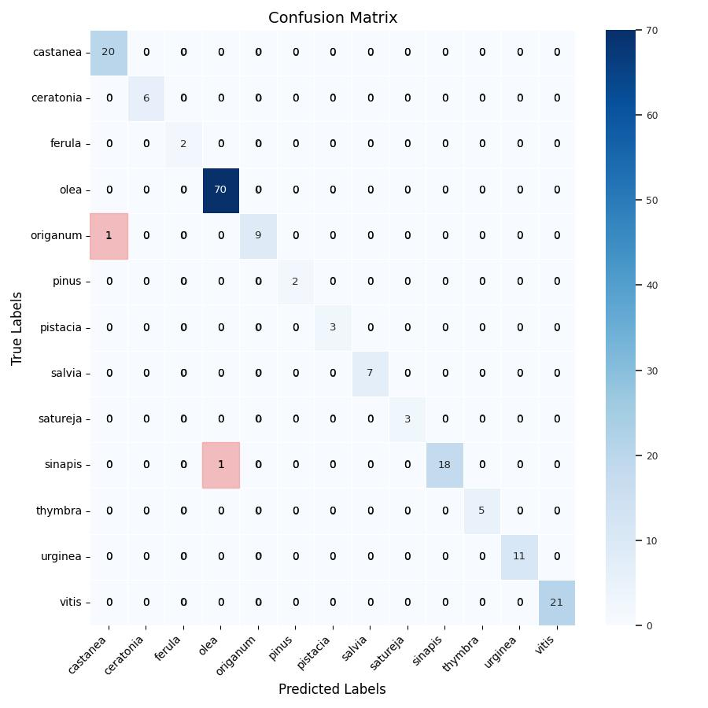

## Table of Contents

- [Pollen_classification_view](#pollen_classification_view)
  - [Installation](#installation)
- [Usage](#usage)
  - [Phase 1](#phase-1)
  - [Phase 2](#phase-2)
- [Interpretation of results](#interpretation-of-results)
  - [Interpretation of Phase 1](#interpretation-of-phase-1)
  - [Interpretation of Phase 2](#interpretation-of-phase-2)
  - [Interpretation of Phase 3](#interpretation-of-phase-3)
- [Project Folder Structure](#project-Folder-Structure)
  - [Description of Key Folders](#description-of-Key-Folders)
  - [Resources](#resources)


# Pollen_classification_view

This project focuses on the classification of pollen grains by taking into account their characteristic views (Equatorial, Polar). The system is divided into three phases:

Phase 1: Separate pollen into views (Equatorial and Polar) using pseudo-labeling.
Phase 2: Refine selected models and classify datasets generated in Phase 1.
Phase 3: Assemble ensembles using models from Phase 2 for more accurate classification.

[Table of contentes](#table-of-contents)

# Installation

Follow the steps below to set up the project environment and dependencies.


**1. Create and activate the virtual environment**
There are several ways to create a virtual environment. In this project, the conda package was used, but you can also choose other tools such as venv or virtualenv based on your preference.

To create the virtual environment using conda, run the following command:
```bash
conda create --name tfGpu python=3.10.13
```

**Activate the virtual environment**:
```bash
conda activate tfGpu
```

**2. Clone the repository**
```bash
git clone https://github.com/jczars/Pollen_classification_view.git
```
**3. Install dependencies**
```bash
cd Pollen_classification_view/
pip install -r requirements.txt
```

**4. Verify the Installation**
After installing the dependencies, you can check if everything was set up correctly. Use the following commands to check the installed packages and the Python version:
```bash
pip list
python3 --version

```
5. Deactivate the Virtual Environment
Once you’re done working on the project, deactivate the virtual environment with the command:
```bash
conda deactivate
```
This will return you to the global system environment.

**6. Re-activate the Virtual Environment**
Whenever you continue working on the project, remember to reactivate the virtual environment:
```bash
conda activate tfGpu
```
By following these steps, you’ll have an isolated environment for the project using conda to manage dependencies and avoid conflicts with other Python installations on your system.

**7. Navigate to the project directory**
```bash
cd Pollen_classification_view
```

**8. Adjust the Python Path (if needed)**
If you encounter issues with module imports, you can manually adjust the `PYTHONPATH`:

Find the current directory:
Run the following command in the terminal to get the current working directory:

To include the project path:
```bash
pwd
```
Build the export PYTHONPATH command:
Combine the result of pwd with the rest of the command to set PYTHONPATH. Assuming the current directory is the desired one:
```bash
export PYTHONPATH=$(pwd):$PYTHONPATH
```

To remove the project path:
```bash
unset PYTHONPATH
```


[Table of contentes](#table-of-contents)

# Usage
## Phase 1
The project is divided into phases, following the outline of phase 1.
**Phase 1**: Separate pollen into views (Equatorial and Polar) using pseudo-labeling.

## Prepare the BI_5 Dataset
The BI_5 dataset is the primary dataset used in this phase. It contains labeled and unlabeled images, essential for the pseudo-labeling and classification tasks.

**Steps to Obtain and Prepare the Dataset**

**1. Create the BD Folder:**
Before downloading the dataset, ensure the BD folder exists in the project root directory. Use the following command to create it:

```bash
mkdir -p ./BD
cd ./BD
```

**2. Download the Dataset:**
Download the dataset directly using the link below. If gdown is not installed, you can install it using pip install gdown.

```bash
pip install gdown
```

```bash
gdown "https://drive.google.com/uc?id=1n6bl72RNBORUeW2ONr_d6_VtKpvVA_cA"
```

**3. Extracting the Dataset:**
After downloading, extract the dataset into the ./BD/ directory:
```bash
unzip BI_Cr_5.zip
```

**4. Verify the Dataset:**
After extraction, ensure that the dataset is correctly organized as described in the Project Folder Structure section. Check if the folder structure matches the expected layout for proper use in the project. [Project Folder Structure](#project-Folder-Structure)

**5. Return to the Project's Root Directory**
After verifying the dataset, return to the project's root directory to proceed with the next steps:
```bash
cd ..
```

## Running Pseudo-Labeling:
After preparing the initial dataset BI_5, the next step is to train pre-trained networks with pseudo-labeling.

**Main Scripts**:
**Strategy 1**: pseudo_reload_train.py
Path:
./Pollen_classification_view/phase1/pseudo_reload_train.py

**Behavior:**

During the first training session, named "time_step 0," a pre-trained network is loaded, fine-tuned using the DFT strategy, and trained with random initialization.
For subsequent time_steps, the model from the previous time_step is reloaded and retrained.

**Strategy 2**: pseudo_train.py
Path:

./Pollen_classification_view/phase1/pseudo_train.py

**Behavior**:

All training sessions are initialized with random weights.

**Recovery Script**:
If the training process fails due to memory consumption or other issues, use the recovery script:

pseudo_reload_train_recovery.py

This script detects the last completed time_step and resumes training from that point.
Stopping Rules for Pseudo-Labeling

**Pseudo-labeling stops when**:
The entire unlabeled dataset has been labeled.
The pseudo-label selection phase does not identify any additional images from the unlabeled dataset.
Thresholds used in the tests include 0.95, 0.99, and 0.995.

**Execution Examples**:

__Single Test__
To execute a single test, specify the start_index and end_index parameters:
```bash
python3 phase1/pseudo_reload_train.py --path results/phase1/Reports/config_pseudo_label_pre.xlsx --start_index 5 --end_index 1
```
This command will execute only test index 5.

**All Tests**
To execute all tests configured in the spreadsheet, starting from index 0:
```bash
python3 phase1/pseudo_reload_train.py --path results/phase1/Reports/config_pseudo_label_pre.xlsx --start_index 0
```
**Recovery**
To resume tests after a failure:
```bash
python3 phase1/pseudo_reload_train_recovery.py --path results/phase1/Reports/config_pseudo_label_pre.xlsx --start_index 0
```
Neste caso, o teste 0, travou! Para reiniciar o treinamento executamos o scritp acima.

**Expected Results**:

The results are stored in the "Reports" folder where the spreadsheet is located. The folder naming convention follows the pattern: id_test, model_name, and reports.

The output includes:

1. **CSV** files containing detailed metrics and predictions.
2. **Graphs** in JPG format, such as:
* Confusion matrix
* Training performance plot
* Boxplot of probabilities

This structure ensures organized storage and easy access to the results of each test.

[Table of contentes](#table-of-contents)


## Phase 2
### Preprocess

**1. dowload dataset**:
**Cretan Pollen Dataset v1 (CPD-1)**
This is the selected dataset. Download the dataset to the BD folder. If the BD folder does not exist, create it in the root directory of the project.
Download the database available at: https://zenodo.org/records/4756361. Choose the Cropped Pollen Grains version and place it in the BD folder.
```bash
wget -O Cropped_Pollen_Grains.rar "https://zenodo.org/records/4756361/files/Cropped%20Pollen%20Grains.rar?download=1"

```
or
```bash
curl -L -o Cropped_Pollen_Grains.rar "https://zenodo.org/records/4756361/files/Cropped%20Pollen%20Grains.rar?download=1"
```
To extract the .rar file, you need to install the unrar tool (if not already installed):
```bash
sudo apt install unrar   # Ubuntu/Debian

```
This installs the unrar tool, which is necessary for extracting .rar files.
```bash
unrar x Cropped_Pollen_Grains.rar
```

**2. Renaming Dataset Classes**
The database class names follow the syntax “1.Thymbra” (e.g., "1.Thymbra", "2.Erica"). We will rename the folders to follow a simpler format like “thymbra”.
Use the rename_folders.py script to rename the classes:

```bash
python3 preprocess/rename_folders.py --path_data BD/Cropped\ Pollen\ Grains/
```
This command runs the rename_folders.py script to rename the class folders inside the Cropped Pollen Grains directory. Each folder name will be converted to lowercase for consistency.

**3. Resize images dataset**
This script reads the images from the Cropped Pollen Grains dataset and checks if they are in the standard size of 224 x 224. If any images do not meet these dimensions, the script creates a new dataset with all images resized to the specified size.

The resizing process uses a configuration file (config_resize.yaml) to define input and output paths, along with other parameters.

**Expected Result**:
A new dataset folder containing all images resized to 224 x 224, ensuring consistency across the dataset.

Usage: To run the resizing script with the configuration file, use the following command:

```bash
python3 preprocess/resize_img_bd.py --config preprocess/config_resize.yaml
```

**4. Separated dataset**:
This script separates the Cropped Pollen Grains dataset into two distinct views: Equatorial and Polar. It uses a configuration file (config_separeted.yaml) to define the input and output paths, along with other processing parameters.

**Expected Results**:
At the end of the execution, the script generates reports and separates images into the specified views (Equatorial and Polar), saving them in the respective folders within the database.

**Usage**:
To run the script, ensure that the configuration file is properly set up, then execute the following command:
```bash
python3 preprocess/separeted_bd.py --config preprocess/config_separeted.yaml
```
Ensure that the classes are correctly specified in the config_separeted.yaml file before running the script.

**5. Split the dataset into views and prepare for cross-validation**:
This script splits the dataset into separate folders to perform cross-validation.

**Inputs**:
A YAML configuration file (example: config_split.yaml) that defines the parameters for the script execution.

**Expected Outputs**:
Two generated folders: EQUATORIAL_R and POLAR_R.
Reports generated as CSV files (split_*.csv) containing information about the splits.

**Example of Execution**:
Ensure that the config_split.yaml file is correctly configured before running the script. Then, use the following command:

```bash
python3 preprocess/split_BD_vistas_k.py --config preprocess/config_split.yaml
```

**6. Data augmentation with balancing**:

This script performs data augmentation using a balancing strategy, where the **goal** variable specifies the target number of images per class. The script counts the samples in each class, and any class below the defined goal is augmented until it reaches the target size.

**Expected Results**:  
At the end of the execution, the script generates a balanced dataset with additional images for classes that initially have fewer samples. The balanced dataset is saved in the specified output folder.

**Usage**:  
To run the script, ensure that the configuration file (`config_balanced.yaml`) is properly set up, then execute the following command:
```bash
python preprocess/balanc_BD_vistas_k.py --config preprocess/config_balanced.yaml
```

[Table of contentes](#table-of-contents)


### Fine-tuning
In this steps, pre-trained models are refined to classify the datasets generated in preprocess. The selected models include DenseNet201, MobileNet, InceptionV3, ResNet152V2 and Xception. The fine-tuning process follows the DFT (Deeply Fine-Tuning) strategy to optimize the network performance.

**Required Configuration**:
To execute the tests, a spreadsheet containing the experimental configurations is required. The default configuration file can be found in the folder:

```bash
results/phase2/reports/config_FT_vistas_121124.xlsx
```
**Execution**:
Use the following command to run the fine-tuning script:
```bash
python phase2/FT_DFT_K10_xlsx.py results/phase2/reports/config_FT_vistas_121124.xlsx
```
**Failure Management**:
During the tests, especially when using memory-intensive networks like DenseNet201, failures may occur due to full memory consumption. To address this, a spreadsheet with control variables tracks the progress of the tests, allowing for recovery.

**Control Variables**:
last_test_index: Index of the last completed test.
k_fold_number: Number of the current k-fold to be executed.
num_k_folds: Number of remaining k-folds to complete the cycle.
num_tests: Number of tests remaining to be executed.
Default Configuration
```bash
last_test_index = 0
k_fold_number = 1
num_k_folds = 10
num_tests = 11
```
This configuration runs 11 tests, covering all k-folds (k=1 to k=10) for each test.

**Recovery Example**:
If a test fails at index 6 with k=9, use the following configuration to resume:
```bash
last_test_index = 6
k_fold_number = 10
num_k_folds = 1
num_tests = 1
```
This setup ensures the tests are resumed in a controlled and efficient manner.

**Expected Results**:
The results are stored in the "reports" folder where the spreadsheet is located. The folder naming convention follows the pattern: id_test, model_name, and reports.

The output includes:

1. **CSV** files containing detailed metrics and predictions.
2. **Graphs** in JPG format, such as:
* Confusion matrix
* Training performance plot
* Boxplot of probabilities
This structure ensures organized storage and easy access to the results of each test.

[Table of contentes](#table-of-contents)


# Interpretation of results

## Interpretation of Phase 1

1. **Overall Class Distribution (data_summary.csv)**

| Class         | Count      |
|---------------|------------|
| asphodelus    | 34         |
| calicotome    | 298        |
| castanea      | 218        |
| ceratonia     | 100        |
| ebenus        | 22         |
| erica         | 181        |
| eucalyptus    | 170        |
| ferula        | 83         |
| myrtus        | 786        |
| olea          | 790        |
| origanum      | 171        |
| oxalis        | 139        |
| pinus         | 29         |
| pistacia      | 34         |
| salvia        | 178        |
| satureja      | 71         |
| sinapis       | 197        |
| thymbra       | 146        |
| urginea       | 109        |
| vitis         | 269        |

2. **Distribution by Views (df_qde_vistas.csv)**

| Class         | Equatorial | Polar   |
|---------------|------------|---------|
| asphodelus    | 5          | 29      |
| calicotome    | 7          | 291     |
| castanea      | 195        | 23      |
| ceratonia     | 62         | 38      |
| ebenus        | 6          | 16      |
| erica         | -          | 181     |
| eucalyptus    | 2          | 168     |
| ferula        | 21         | 62      |
| myrtus        | -          | 786     |
| olea          | 699        | 91      |
| origanum      | 98         | 73      |
| oxalis        | 8          | 131     |
| pinus         | 25         | 4       |
| pistacia      | 23         | 11      |
| salvia        | 71         | 107     |
| satureja      | 36         | 35      |
| sinapis       | 182        | 15      |
| thymbra       | 52         | 94      |
| urginea       | 107        | 2       |
| vitis         | 216        | 53      |

3. **Distribution After Threshold Filtering (df_summary_filtered.csv)**

| Class         | Equatorial | Polar   |
|---------------|------------|---------|
| castanea      | 195        | 23      |
| ceratonia     | 62         | 38      |
| ferula        | 21         | 62      |
| olea          | 699        | 91      |
| origanum      | 98         | 73      |
| pinus         | 25         | -       |
| pistacia      | 23         | -       |
| salvia        | 71         | 107     |
| satureja      | 36         | 35      |
| sinapis       | 182        | -       |
| thymbra       | 52         | 94      |
| urginea       | 107        | -       |
| vitis         | 216        | 53      |
| asphodelus    | -          | 29      |
| calicotome    | -          | 291     |
| erica         | -          | 181     |
| eucalyptus    | -          | 168     |
| myrtus        | -          | 786     |
| oxalis        | -          | 131     |


[Table of contentes](#table-of-contents)
## Interpretation of Phase 2

## 4. Classification Report for DenseNet201 (k=1, Equatorial View)

This section presents the results obtained using the DenseNet201 classifier on the **k=1 fold** with **equatorial views**. The evaluation includes training performance metrics, a boxplot of prediction probabilities, a confusion matrix, and a classification report.

### 4.1 Training Metrics
The following graph illustrates the **loss and accuracy** progression during training:


### 4.2 Prediction Confidence Analysis
The boxplot below displays the **distribution of prediction probabilities** for correctly classified samples:


### 4.3 Confusion Matrix
The confusion matrix generated from the test dataset classification is shown below:



### 4.4 Classification Report
The table below presents detailed metrics for each class:

|    Class     | Precision | Recall | F1-Score | Support |
|--------------|-----------|--------|----------|---------|
| castanea     | 0.952     | 1.000  | 0.976    | 20      |
| ceratonia    | 1.000     | 1.000  | 1.000    | 6       |
| ferula       | 1.000     | 1.000  | 1.000    | 2       |
| olea         | 0.986     | 1.000  | 0.993    | 70      |
| origanum     | 1.000     | 0.900  | 0.947    | 10      |
| pinus        | 1.000     | 1.000  | 1.000    | 2       |
| pistacia     | 1.000     | 1.000  | 1.000    | 3       |
| salvia       | 1.000     | 1.000  | 1.000    | 7       |
| satureja     | 1.000     | 1.000  | 1.000    | 3       |
| sinapis      | 1.000     | 0.947  | 0.973    | 19      |
| thymbra      | 1.000     | 1.000  | 1.000    | 5       |
| urginea      | 1.000     | 1.000  | 1.000    | 11      |
| vitis        | 1.000     | 1.000  | 1.000    | 21      |
| **accuracy** |           |        | 0.989    | 179     |
| **macro avg**| 0.995     | 0.988  | 0.992    | 179     |
| **weighted avg** | 0.989 | 0.989  | 0.989    | 179     |


4.5 **Summary**
These are the tools used to interpret the test results.

[Table of contentes](#table-of-contents)
## Interpretation of Phase 3

[Table of contentes](#table-of-contents)

# Project Folder Structure
Below is the folder structure for the `Pollen_classification_view` project:
```bash
Pollen_classification_view
├── BD
│   ├── BI_5
│     ├── images_unlabels
│     │   └── unlabeled
│     └── labels
│       ├── equatorial_alongada
│       ├── equatorial_circular
│       ├── equatorial_eliptica
│       ├── polar_circular
│       ├── polar_triangular
│       └── polar_tricircular
│   ├── CPD1_Dn_VTcr_111124
│       ├── EQUATORIAL
│       │    ├── castanea
│       │    ├── ceratonia
│       │    ├── ebenus
│       │    ├── ferula
│       │    ├── myrtus
│       │    ├── olea
│       │    ├── ...
│       ├── EQUATORIAL_R
│       │    ├── csv
│       │    ├── Test
│       │    │    └── k1
│       │    │        ├── castanea
│       │    │        ├── ceratonia
│       │    │        ├── ebenus
│       │    │        ├── ...
│       │    │    ├── k2
│       │    │    ├── k3
│       │    │    ├── ...
│       │    ├── Train
│       │    │    └── k1
│       │    │        ├── castanea
│       │    │        ├── ceratonia
│       │    │        ├── ebenus
│       │    │        ├── ...
│       │    │    ├── k2
│       │    │    ├── k3
│       │    │    ├── ...
│       ├── POLAR
│       │    ├── asphodelus
│       │    ├── calicotome
│       │    ├── ceratonia
│       │    ├── erica
│       │    ├── eucalyptus
│       │    ├── ferula
│       │    ├── ...
│       ├── POLAR_R
│       │    ├── csv
│       │    ├── Test
│       │    │    └── k1
│       │    │        ├── asphodelus
│       │    │        ├── calicotome
│       │    │        ├── erica
│       │    │        ├── ...
│       │    │    ├── k2
│       │    │    ├── k3
│       │    │    ├── ...
│       │    ├── Train
│       │    │    └── k1
│       │    │        ├── asphodelus
│       │    │        ├── calicotome
│       │    │        ├── erica
│       │    │        ├── ...
│       │    │    ├── k2
│       │    │    ├── k3
│       │    │    ├── ...
│   ├── CPD1_Cr_Rc
│       ├── asphodelus
│       ├── calicotome
│       ├── castanea
│       ├── ceratonia
│       ├── ...
│   ├── Cropped Pollen Grains
│       ├── 1.Thymbra
│       ├── 2.Erica
│       ├── 3.Castanea
│       ├── 4.Eucalyptus
│       ├── ...
├── images
│   ├── Test_0_0_DenseNet201_boxplot_k1.jpg
│   ├── Test_0_0_DenseNet201_mat_conf_k1.jpg
│   ├── Test_0_0_DenseNet201_TrainLoss_k1.jpg
├── interpretation
│   ├── radar_chart.ipynb
├── models
│   ├── del_folders_limiar.py
│   ├── get_calssifica.py
│   ├── get_data.py
│   ├── listar vistas.py
│   ├── maneger_gpu.py
│   ├── models_pre.py
│   ├── models_train.py
│   ├── reports_build.py
│   ├── reports_ens.py
│   ├── sound_test_finalizado.py
│   ├── utils.py
│   ├── voto_majoritary.py
├── phase1
│   ├── pseudo_reload_train_recovery.py
│   ├── pseudo_reload_train.py
│   ├── pseudo_train.py
├── phase2
│   ├── FT_DFT_K10_xlsx.py
├── preprocess
│   ├── balanced_BD_vistas_k.py
│   ├── config_balanced.yaml
│   ├── config_resize.yaml
│   ├── config_separeted.yaml
│   ├── config_split.yaml
│   ├── rename_folders.py
│   ├── resize_img_bd.py
│   ├── separeted_bd.py
│   ├── split_BD_vistas_k.py
├── results
│   ├── phase 1
│       ├── reports
│            ├── 5_DenseNet201_sem_BI_5
│            ├── config_pseudo_label_pre.xlsx
│   ├── phase 2
│       ├── reports
│            ├── 0_DenseNet201
│            ├── 0_DenseNet201_reports
│            ├── config_FT_vistas_Aug400_181124.xlsx
```

[Table of contentes](#table-of-contents)

## Description of Key Folders:

- **`0_pseudo_labels/`**: Contains scripts and reports for the pseudo-labeling process.
  - **`Reports/`**: Reports generated during the pseudo-labeling process.
  - **`pseudo_reload_train.py`**: Main script used to generate pseudo-labels.
  - **'pseudo_reload_train_recovery.py'**: script recovery. to continue pseudo-labels

- **`1_create_bd/`**: Scripts for creating balanced and resized datasets.
  - **`balanced_BD_views.py`**: Script to create balanced datasets for equatorial and polar views.
  - **`config_balanced.yaml`**: Configuration file for balancing datasets.
  - **`config_resize.yaml`**: Configuration file for resizing images.
  - **`config_separeted.yaml`**: Configuration file for separeted dataset.
  - **`config_split.yaml`**: Configuration file for split dataset.
  - **`rename_folders.py`**: Script for renaming the folders the dataset images.
  - **`resize_img_bd.py`**: Script for resizing the dataset images.
  - **`separeted_bd.py`**: Script to exclude from the dataset classes that have amounts of images below the chosen threshold.
  - **`split_BD_views.py`**: Script for splitting datasets based on views[EQUATORIAL, POLAR].

- **`2_fine_tuned/`**: Contains scripts for fine-tuning pre-trained models and generating reports.
  - **`Reports`**: Folder that stores the test results.
    - **`config_FT_vistas_121124.xlsx`**: spreadsheet containing the experiment settings.
  - **`FT_DFT_K10_Aug_xlsx.py`**: script for fine-tuned models that works with data augmentation passed as a parameter at runtime.
  - **`FT_DFT_K10_xlsx.py`**: script for fine-tuned models that work with increased stored data.

- **`3_ensemble/`**: Contains scripts for creating ensemble models using trained networks.
  - **`Reports`**: Folder that stores the test results.
    - **`EQUATORIAL_ens_131124.xlsx`**: spreadsheet containing the experiment settings to views EQUATORIAL.
    - **`POLAR_ens_131124.xlsx`**: spreadsheet containing the experiment settings to views POLAR.
  - **`Ensemble.py`**: Main script for generating ensemble models.
  - **`conf_vote.yaml`**: Configuration file for ensemble voting strategies.
  - **`config_eq.yaml`**: Configuration file for ensemble to viwes EQUATORIAL.
  - **`config_pl.yaml`**: Configuration file for ensemble to viwes POLAR.

- **`modules/`**: Contains various utility scripts and modules for data handling, model training, and GPU management.
  - **`get_classifica.py`**: Script responsible for classification.
  - **`get_data.py`**: Script for data loading and preprocessing.
  - **`manage_gpu.py`**: Script for managing GPU resources.
  - **`models_pre.py`**: Models used for data preprocessing.
  - **`models_train.py`**: Models for training neural networks.
  - **`reports_build.py`**: Script for generating reports.
  - **`utils.py`**: Utility functions for various tasks.
  - **`..`**: other complementary scripts.

- **`BD/`**: Folder used to store the datasets used in the project.
  - **`BI_5/`**: Database folder containing labeled and unlabeled pollen grain images.
    - **`images_unlabels/`**: Contains unlabeled images for classification.
      - **`unlabeled/`**: Folder with unlabeled images for pseudo-labeling.
    - **`labels/`**: Folder with images labeled by a palynology expert.
      - Each folder inside **`labels/`** contains images for specific classes (e.g., `equatorial_circular`, `polar_triangular`, etc.).
## Resources

The experiments were conducted on a Linux-based system with the following hardware and software specifications:
 **Operating System**
```bash
Linux jczars-gamer 6.8.0-47-generic #47~22.04.1-Ubuntu SMP PREEMPT_DYNAMIC Wed Oct 2 16:16:55 UTC 2 x86_64 x86_64 x86_64 GNU/Linux
```
**Processor (CPU)**:

- **Architecture**: x86_64  
- **Operational Mode**: 32-bit, 64-bit  
- **Address Sizes**: 39 bits physical, 48 bits virtual  
- **Byte Order**: Little Endian  
- **Total CPUs**: 16  
- **Online CPUs**: 0-15  
- **Vendor ID**: GenuineIntel  
- **Model Name**: Intel(R) Core(TM) i7-10700F CPU @ 2.90GHz  
- **Family**: 6  
- **Model**: 165  
- **Threads per Core**: 2  
- **Cores per Socket**: 8  
- **Sockets**: 1  
- **Step**: 5  
- **Max CPU MHz**: 4800 MHz  
- **Min CPU MHz**: 800 MHz  
- **BogoMIPS**: 5799.77  

**Graphics Card (GPU)**

- **Model**: NVIDIA GeForce RTX 3060  
- **Memory**: 12.000 GiB  
- **Driver Version**: 535.183.01  
- **CUDA Version**: 12.2  

[Table of contentes](#table-of-contents)
